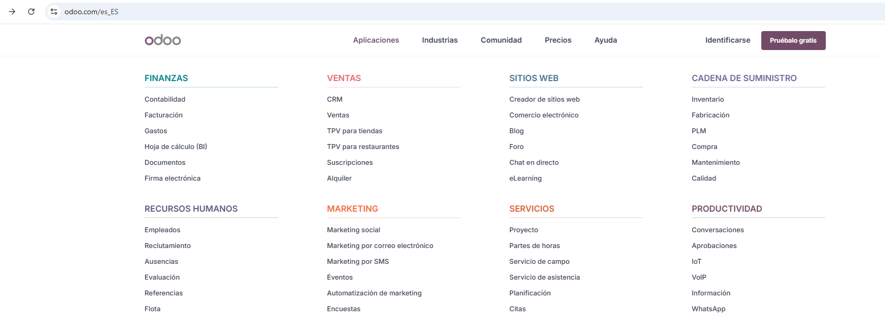
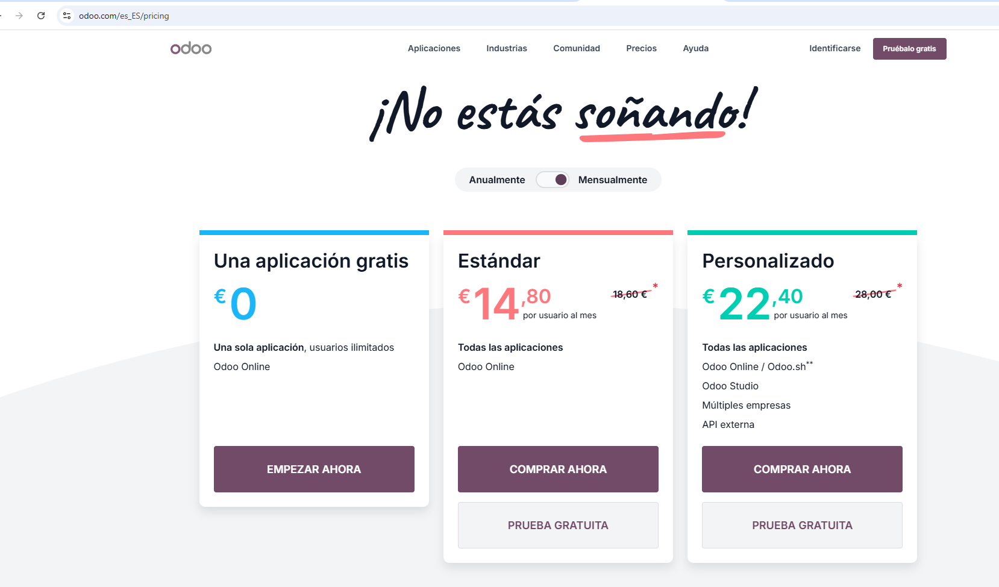

# Comparativa de ERPs actuales

## 1. Análisis de los ERPs elegidos

### SAP Business One

SAP Business One es un ERP diseñado para pequeñas y medianas empresas, que centraliza procesos clave como finanzas, ventas, inventario y operaciones. Permite obtener visibilidad en tiempo real de la información del negocio, mejorar la toma de decisiones y optimizar recursos. Su estructura integrada y flexible facilita la automatización de procesos y el crecimiento sostenible de la empresa.

### Odoo

Odoo es un software ERP de código abierto que integra múltiples aplicaciones para administrar diferentes áreas de una empresa, como ventas, contabilidad, inventario, recursos humanos y marketing. Su modularidad permite adaptar el sistema según las necesidades del negocio, facilitando la automatización de procesos y la centralización de la información. Además, ofrece una interfaz amigable y opciones tanto en la nube como on-premise, lo que lo hace accesible para empresas de distintos tamaños.

### Salesforce

Salesforce es un CRM basado en la nube, diseñado para optimizar ventas, marketing, atención al cliente y análisis de datos. Permite centralizar la información de los clientes, automatizar procesos comerciales y generar reportes en tiempo real. Su ecosistema de aplicaciones y personalización lo hace adaptable a empresas de diferentes tamaños y sectores, fomentando la eficiencia y la fidelización del cliente.

## 2. Casos en los que elegirías esos ERPs

### SAP Business One

Lo usaría en empresas pequeñas en las que los empleados estén dispuestos a dedicar algo más de tiempo en aprender como funciona el software y en las que la implementación o el cambio a usar este ERP pueda darse más tiempo.

### Odoo

Lo utilizaría en empresas pequeñas en las que los empleados no estén muy familiarizados con la informática, ya que es más fácil de aprender a usar que SAP Business One. Además, si fuera necesario, se podría ir escalando con más funcionalidades más adelante, cuando los empleados estén familiarizados con el software.

### Salesforce

La usaría en empresas centradas en la gestión de clientes y/o marketing, ya que es en lo que se especializa este software.

## 3. Tabla comparativa ERPs

| Criterio                         | SAP Business One                                                                                                                                                                                             | Odoo                                                                                                                                                                                                                    | Salesforce                                                                                                                    |
| :--------------------------------- | -------------------------------------------------------------------------------------------------------------------------------------------------------------------------------------------------------------- | ------------------------------------------------------------------------------------------------------------------------------------------------------------------------------------------------------------------------- | ------------------------------------------------------------------------------------------------------------------------------- |
| Modelo de despliegue             | Versión Saas, on-premise e híbrida.                                                                                                                                                                        | Versión SaaS (en la nube) y versión on-premise (local).                                                                                                                                                               | En la nube.                                                                                                                   |
| Facilidad de uso                 | Curva de aprendizaje exigente al inicio. Cuenta con aplicación móvil, pero eres tú el que tiene que crear la versión móvil de tus aplicaciones SAP.                                                     | Curva de aprendizaje accesible para usuarios no especialistas. Aplicación móvil disponible con la mayoría de módulos.                                                                                               | Curva de aprendizaje sencilla para usuarios que quieren utilizar sus funciones básicas.                                      |
| Personalización e integración  | SAP Integration Suite permite conectar aplicaciones SAP y de terceros y ofrece integraciones y conectores preconfigurados para soluciones de SAP y de terceros. Tambien tiene capacidad para gestionar APIs. | Creación de módulos personalizados con Odoo Studio. Tienda de aplicaciones para extender las funcionalidades básicas. Integración con servicios externos mediante APIs.                                             | Integración con aplicaciones internas y externas. Cuenta con un mercado de aplicaciones que se pueden usar junto con su CRM. |
| Seguridad y cumplimiento         | SAP permite seleccionar dónde se guardan los datos, atendiendo a normativas locales, incluida la UE. Copias de seguridad diarias.                                                                           | Múltiples copias de seguridad por cada base de datos. Aislamiento entre bases de datos de distintos clientes. Cumple con RGDP.                                                                                         | Copias de seguridad periódicas. Control de acceso basado en roles. Cumple con la RGDP.                                       |
| Cobertura funcional por procesos | Contabilidad y Finanzas, Ventas y Gestión de Clientes, Compras y Gestión de Proveedores, Inventario, Producción, Informes y Gestión de Activos Fijos.                                                    | CRM, Ventas, Comercio electrónico, Gestión de Inventario, Contabilidad, Recursos Humanos, Proyectos, Gastos,  Compras, etc.                                                                                           | CRM, Automatización, Análisis, Informes, IA, Gestión de Contactos.                                                         |
| Coste total estimado             | Su licencia profesional cuesta 2700€ por usuario si se va a usar de manera local. Para una implementanción en la nube, el costo de la suscripción es de 91€ por usuario al mes.                          | El plan estándar para acceder a todos los módulos es de 14,80€ al mes. El precio es por cada empleado que vaya a utilizarlo. Si lo usas de forma local habría que añadir el coste del servidor y su mantenimiento. | Cuenta con dos suscripciónes: una básica por 25€ al mes por usuario y otra más avanzada por 100€ al mes por usuario      |
| Escalabilidad                    | Permite gestionar múltiples empresas desde una instalación. Permite múltiples usuarios concurrentes.                                                                                                      | Se pueden configurar varias empresas en una misma base de datos. Permite bastantes usuarios concurrentes y un gran volumen de transacciones.                                                                            | Ofrece opciones para empresas pequeñas, startups y empresas más grandes                                                     |

## 4. Conclusiones para el caso concreto

Después de investigar sobre estas 3 opciones de software, en el caso propuesto de el gimnasio, me quedaría con Odoo. Primero que nada descarto Salesforce porque ni siquiera es lo que necesitan, ya que ellos requieren un ERP, no un CRM. Y me quedo con Odoo antes que SAP Business One por dos razones: la primera es que es más fácil aprender a utilizarlo, ya que me imagino que la gente de esta empresa no estará muy enterada en como manejarse con los ordenadores, y segundo porque su implementación sería en un principio más económica.

## 5. Fuentes y evidencias

[Odoo modelos de despliegue](https://www.odoo.com/es/page/hosting-types)
[Odoo conexión con APIs externas](https://www.odoo.com/documentation/18.0/developer/reference/external_api.html)
[Odoo exportar/importar módulos creados con Odoo Studio](https://www.odoo.com/documentation/14.0/applications/productivity/studio/how_to/export_import.html)
[Odoo seguridad](https://www.odoo.com/es_ES/security)

[SAP modelos de despliegue](https://www.sap.com/spain/resources/cloud-erp-deployment-options#opciones-de-implementaci%C3%B3n-de-erp)
[SAP móvil](https://help.sap.com/docs/MOBILE_SERVICE_FOR_SAP_FIORI/57a7f2d613644550aeb3e5670b39f096/aa894baecb0b4e82b42477b02f2195aa.html)
[SAP integración](https://www.sap.com/spain/products/technology-platform/integration-suite/what-is-sap-integration-suite.html)
[SAP centros de datos](https://www.sap.com/spain/about/trust-center/data-center.html)
[SAP seguridad](https://help.sap.com/doc/4398a486f93c4abfa70a1201512dcd73/2408/es-ES/f6c22355af83f651e10000000a423f68.pdf)
[SAP módulos](https://www.sap.com/spain/products/erp/business-one/features.html)
[SAP precios](https://www.itop.es/blog/item/licencias-y-precios-de-sap-business-one.html)
[Salesforce página principal](https://www.salesforce.com/es/crm/)
[Salesforce precios](https://www.salesforce.com/es/crm/pricing/)
[Salesforce seguridad](https://www.salesforce.com/es/platform/data-security/what-is-data-security/)
[Salesforce normativas seguridad](https://help.salesforce.com/s/articleView?id=sf.mc_rn_january_2020_dmp_ccpa.htm&type=5)
